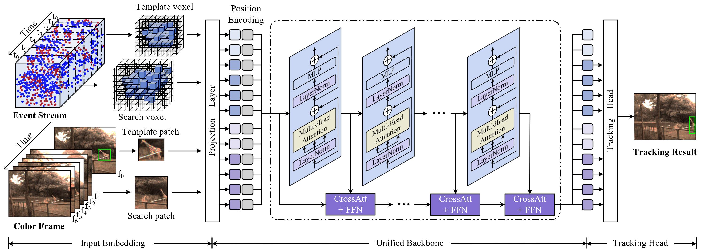
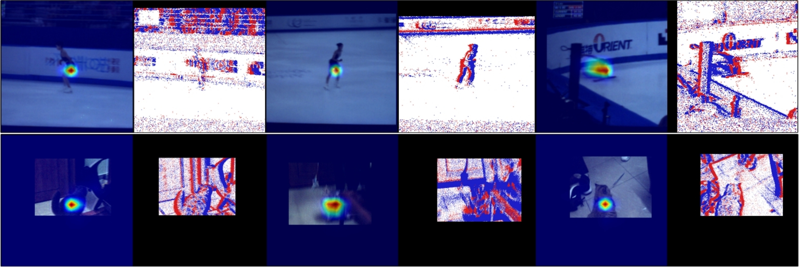

# CEUTrack

A unified framework for color-event tracking. 

<p align="center">
  
</p>

[[Models](https://pan.baidu.com/s/1B6VPTqoltVCgOCfceK7bTA )] Passcode：0uk0
[[Raw Results](https://pan.baidu.com/s/1ZCpz9qvrirwnyK-egFPbCg )] Passcode：zisx
[[Training logs](https://pan.baidu.com/s/12KHyJZ-X4UQu0xjsoKEPqg )] Passcode：hnim


It consist of the following folds:

```
-CEUTrack
--experiments: the config files about training and testing.
--lib: details about model and training
--scripts: many scripts for dataset preprocess.
--tracking: tracking and evaluation scripts.
```


Install env
```
conda create -n event python=3.7
conda activate event
bash install.sh
```

Run the following command to set paths for this project
```
python tracking/create_default_local_file.py --workspace_dir . --data_dir ./data --save_dir ./output
```

After running this command, you can also modify paths by editing these two files
```
lib/train/admin/local.py  # paths about training
lib/test/evaluation/local.py  # paths about testing
```

Then, put the tracking datasets COESOT in `./data`. 

Download pre-trained [MAE ViT-Base weights](https://dl.fbaipublicfiles.com/mae/pretrain/mae_pretrain_vit_base.pth) and put it under `$/pretrained_models`

Download the model weights and put it on `$/output/checkpoints/train/ceutrack`


## Train & Test & Evaluation
```
    # train
    export CUDA_VISIBLE_DEVICES=0
    python tracking/train.py --script ceutrack --config ceutrack_coesot  \
    --save_dir ./output --mode multiple --nproc_per_node 1 --use_wandb  0
    # test
    python tracking/test.py   ceutrack ceutrack_coesot --dataset coesot --threads 4 --num_gpus 1
    # eval
    python tracking/analysis_results.py --dataset coesot  --parameter_name ceutrack_coesot
```


### Test FLOPs, and Speed
*Note:* The speeds reported in our paper were tested on a single RTX 3090 GPU.

```
# Profiling ceutrack_coesot
python tracking/profile_model.py --script ceutrack --config ceutrack_coesot
```


### Activation Visualization 
Use the script from: [[show_CAM.py](https://github.com/Event-AHU/COESOT/blob/main/CEUTrack/scripts/show_CAM.py)]

```
from .show_CAM import getCAM
getCAM(response, curr_image, self.idx)
```

<p align="center">
  
</p>


