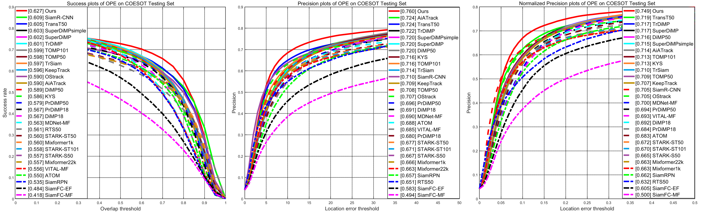

The implementation of COESOT evaluation toolkit.

### COESOT_eval_toolkit
1. unzip the COESOT_eval_toolkit.zip, and open it with Matlab (over Matlab R2020).
2. add your tracking results and [baseline results (Passcode：siaw)](https://pan.baidu.com/s/1YN07LHERxO31zflMUzgK4A)  in `$/coesot_tracking_results/` and modify the name in `$/utils/config_tracker.m`.    BTW, here we also provide the event-only baseline tracking methods results in [[Event_only Results](https://pan.baidu.com/s/1-8dKCOqt7xtJcoyb8D3RmQ )] Passcode：qblp

3. run `Evaluate_COESOT_benchmark_SP_PR_only.m` for the overall performance evaluation, including SR, PR, NPR.

  

4. run `plot_BOC.m` for BOC score evaluation and figure plot.
5. run `plot_radar.m` for attributes radar figrue plot.

  

6. run `Evaluate_COESOT_benchmark_attributes.m` for attributes analysis and figure saved in `$/res_fig/`. 

