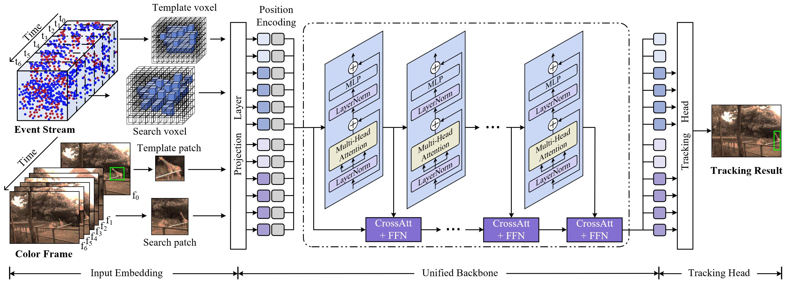

<div align="center">
 
 

**A general and large-scale benchmark COESOT dataset for color-event based visual tracking**

 ------
 
</div>

> **[Revisiting Color-Event based Tracking: A Unified Network, Dataset, and Metric](https://arxiv.org/abs/2211.11010)**, Chuanming Tang, Xiao Wang, Ju Huang, Bo Jiang, Lin Zhu, Jianlin Zhang, Yaowei Wang, Yonghong Tian 
[[Project](https://sites.google.com/view/coesot/)]


### Update Log 

* :fire: [2024.03.12] A New Long-term RGB-Event based Visual Object Tracking Benchmark Dataset (termed **FELT**) is available at
  [[Paper](https://arxiv.org/pdf/2403.05839.pdf)] 
  [[Code](https://github.com/Event-AHU/FELT_SOT_Benchmark)] 
  [[DemoVideo](https://youtu.be/6zxiBHTqOhE?si=6ARRGFdBLSxyp3G8)]

* :fire: [2024.03.06] Tracking results of CEUTrack on **VisEvent** dataset is available at [[ceutrack_visevent_dataset_tracking_results.zip](https://github.com/Event-AHU/COESOT/blob/main/ceutrack_visevent_dataset_tracking_results.zip)] 

* :fire: [2023.09.27] A High Definition (HD) Event based Visual Object Tracking Benchmark Dataset (termed **EventVOT**) is available at
[[arXiv](https://arxiv.org/abs/2309.14611)] [[Github](https://github.com/Event-AHU/EventVOT_Benchmark)] 


### Demo Video: 
* [[YouTube](https://youtu.be/_ROv09rvi2k)]


### Dataset Download: 
```
Baidu Download link：https://pan.baidu.com/s/12XDlKABlz3lDkJJEDvsu9A     Passcode：AHUT 
```

The directory should have the below format:
```Shell
├── COESOT dataset
    ├── Training Subset (827 videos, 160GB)
        ├── dvSave-2021_09_01_06_59_10
            ├── dvSave-2021_09_01_06_59_10_aps
            ├── dvSave-2021_09_01_06_59_10_dvs
            ├── dvSave-2021_09_01_06_59_10.aedat4
            ├── groundtruth.txt
            ├── absent.txt
            ├── start_end_index.txt
        ├── ... 
    ├── Testing Subset (528 videos, 105GB)
        ├── dvSave-2021_07_30_11_04_12
            ├── dvSave-2021_07_30_11_04_12_aps
            ├── dvSave-2021_07_30_11_04_12_dvs
            ├── dvSave-2021_07_30_11_04_12.aedat4
            ├── groundtruth.txt
            ├── absent.txt
            ├── start_end_index.txt
        ├── ... 
```

<p align="center">
  
</p>


### COESOT_eval_toolkit
1. unzip the COESOT_eval_toolkit.zip, and open it with Matlab (over Matlab R2020).
2. add your tracking results and [baseline results (Passcode：siaw)](https://pan.baidu.com/s/1YN07LHERxO31zflMUzgK4A)  in `$/coesot_tracking_results/` and modify the name in `$/utils/config_tracker.m`.    BTW, here we also provide the event-only baseline tracking methods results in [[Event_only Results](https://pan.baidu.com/s/1-8dKCOqt7xtJcoyb8D3RmQ )] Passcode：qblp


3. run `Evaluate_COESOT_benchmark_SP_PR_only.m` for the overall performance evaluation, including SR, PR, NPR.

<p align="left">
  
</p>

4. run `plot_BOC.m` for BOC score evaluation and figure plot.
5. run `plot_radar.m` for attributes radar figrue plot.

<p align="center">
  
</p>

6. run `Evaluate_COESOT_benchmark_attributes.m` for attributes analysis and figure saved in `$/res_fig/`. 


# CEUTrack
A unified framework for color-event tracking. 

[[Models](https://pan.baidu.com/s/1B6VPTqoltVCgOCfceK7bTA )] Passcode：0uk0
[[Raw Results](https://pan.baidu.com/s/1tzLABOFTpF1SNytj05dFzg)] Passcode：yeow
[[Training logs](https://pan.baidu.com/s/12KHyJZ-X4UQu0xjsoKEPqg )] Passcode：hnim

<p align="center">
  
</p>


Install env
```
conda create -n event python=3.7
conda activate event
bash install.sh
```

Run the following command to set paths for this project
```
python tracking/create_default_local_file.py --workspace_dir . --data_dir ./data --save_dir ./output
```

After running this command, you can also modify paths by editing these two files
```
lib/train/admin/local.py  # paths about training
lib/test/evaluation/local.py  # paths about testing
```

Then, put the tracking datasets COESOT in `./data`. 

Download pre-trained [MAE ViT-Base weights](https://dl.fbaipublicfiles.com/mae/pretrain/mae_pretrain_vit_base.pth) and put it under `$/pretrained_models`

Download the model weights and put it on `$/output/checkpoints/train/ceutrack`


## Train & Test & Evaluation
```
    # train
    export CUDA_VISIBLE_DEVICES=0
    python tracking/train.py --script ceutrack --config ceutrack_coesot  \
    --save_dir ./output --mode multiple --nproc_per_node 1 --use_wandb  0
    # test
    python tracking/test.py   ceutrack ceutrack_coesot --dataset coesot --threads 4 --num_gpus 1
    # eval
    python tracking/analysis_results.py --dataset coesot  --parameter_name ceutrack_coesot
```


### Test FLOPs, and Speed
*Note:* The speeds reported in our paper were tested on a single RTX 3090 GPU.

```
# Profiling ceutrack_coesot
python tracking/profile_model.py --script ceutrack --config ceutrack_coesot
```


### Activation Visualization 
Use the script from: [[show_CAM.py](https://github.com/Event-AHU/COESOT/blob/main/CEUTrack/scripts/show_CAM.py)]

```
from .show_CAM import getCAM
getCAM(response, curr_image, self.idx)
```

<p align="center">
  
</p>


## TODO List 
- [x] Paper (arXiv) release
- [x] COESOT dataset release
- [x] Evaluation Toolkit release
- [x] Source Code release
- [x] Tracking Models release


### Acknowledgments
* Thanks for the [OSTrack](https://github.com/botaoye/OSTrack), [PyTracking](https://github.com/visionml/pytracking) and [ViT](https://github.com/rwightman/pytorch-image-models) library for a quickly implement.


### Citation: 
```bibtex
@article{tang2022coesot,
  title={Revisiting Color-Event based Tracking: A Unified Network, Dataset, and Metric},
  author={Tang, Chuanming and Wang, Xiao and Huang, Ju and Jiang, Bo and Zhu, Lin and Zhang, Jianlin and Wang, Yaowei and Tian, Yonghong},
  journal={arXiv preprint arXiv:2211.11010},
  year={2022}
}
```


## Star History

<a href="https://star-history.com/#Event-AHU/COESOT&Date">
 <picture>
   <source media="(prefers-color-scheme: dark)" srcset="https://api.star-history.com/svg?repos=Event-AHU/COESOT&type=Date&theme=dark" />
   <source media="(prefers-color-scheme: light)" srcset="https://api.star-history.com/svg?repos=Event-AHU/COESOT&type=Date" />
   
 </picture>
</a>

